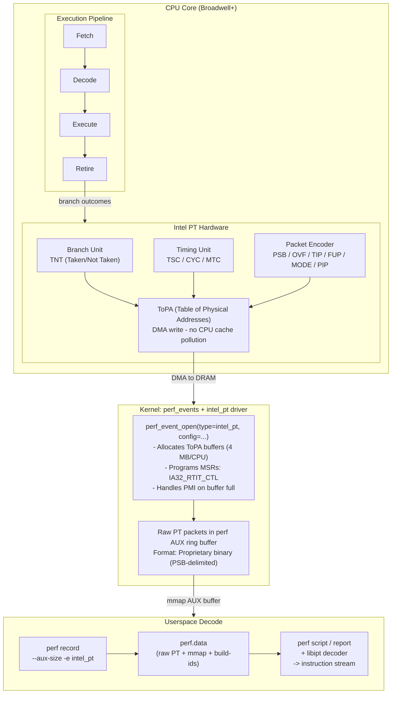
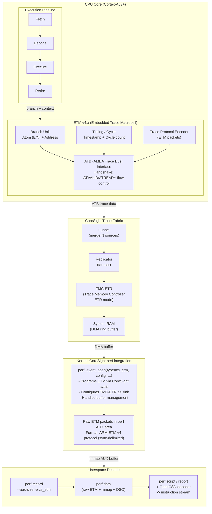
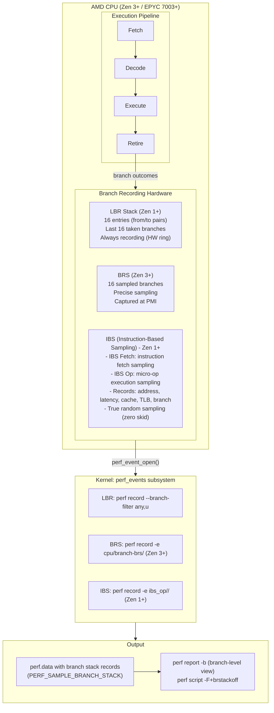
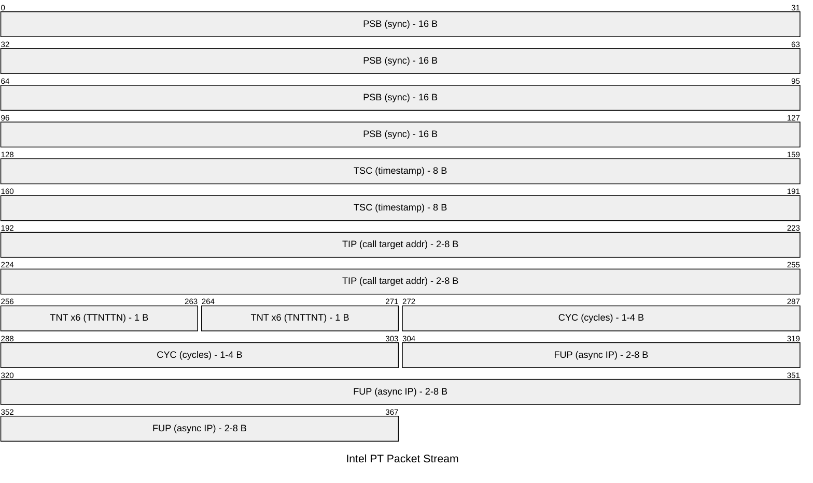
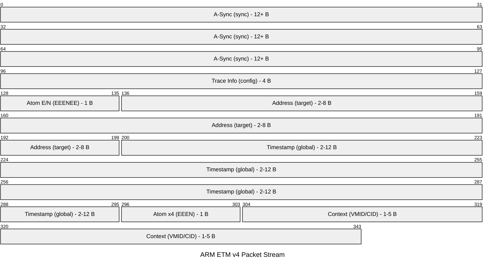

# AAIF Reference Architecture: Processor Tracing (Intel PT / ARM ETM / AMD IBS)

| Field | Value |
|-------|-------|
| **Subject** | [Intel Processor Trace](https://www.intel.com/content/www/us/en/developer/tools/oneapi/vtune-profiler.html) / [ARM Embedded Trace Macrocell](https://developer.arm.com/documentation/ihi0064/latest/) / [AMD IBS](https://developer.amd.com/resources/developer-guides-manuals/) |
| **Version** | Intel PT: Broadwell+ (5th gen Core, 2015-present); ARM ETM v4.x (ARMv8-A, Cortex-A53+); AMD IBS: Zen 1+ (2017-present), BRS: Zen 3+ (2020-present) |
| **Date** | 2026-08-10 |

---

## Objective

Demonstrates how hardware processor tracing - Intel PT on x86_64, ARM ETM on AArch64, and AMD IBS/BRS on Zen - provides instruction-level control flow and micro-architectural observability with <5% runtime overhead, enabling exact coverage analysis, deterministic replay (Intel PT/ARM ETM), precise memory-access profiling (AMD IBS), and full call-graph recovery for AI agent runtimes, inference engines, and kernel-level debugging.

---

## Scope / Zoom Level

**Primitive layer - CPU hardware trace generation through kernel driver to userspace decode.**

Processor tracing operates at the lowest possible instrumentation level: the CPU pipeline itself records every taken branch, interrupt, and exception as a compressed packet stream. This sits below kernel tracing (FTrace/LTTng observe kernel functions) and below application profiling (perf samples statistically). Processor tracing provides ground truth: every instruction executed, every branch taken or not taken, with cycle-accurate timing.

The three vendors represent two fundamentally different approaches:
- **Intel PT and ARM ETM**: Continuous full-stream tracing (every branch recorded)
- **AMD IBS/BRS/LBR**: Sampled snapshots with micro-architectural context (cache, TLB, NUMA)

---

## Prerequisites

| Component | Version / Pinned | Notes |
|-----------|-----------------|-------|
| **Intel PT** | | |
| CPU | Broadwell+ (Core 5th gen, Xeon v4+) | `grep intel_pt /proc/cpuinfo` |
| Linux kernel | >= 4.1 (basic); >= 5.10 (recommended) | `CONFIG_PERF_EVENTS=y`, `CONFIG_INTEL_PT=y` (built-in on major distros) |
| perf | Matches kernel | Intel PT decoder linked against libipt |
| libipt | >= 2.0 | Intel PT decode library |
| **ARM ETM** | | |
| CPU | Cortex-A53+ with CoreSight ETMv4 | Check `/sys/bus/coresight/devices/` |
| Linux kernel | >= 4.4 (basic); >= 5.15 (recommended) | `CONFIG_CORESIGHT=y`, `CONFIG_CORESIGHT_SOURCE_ETM4X=y` |
| perf | Matches kernel | ARM CoreSight perf integration |
| OpenCSD | >= 1.2 | Open CoreSight Decoder library |
| **AMD IBS/BRS** | | |
| CPU | Zen 1+ (IBS/LBR); Zen 3+ (BRS) | `grep -E "ibs|brs" /proc/cpuinfo` or check family >= 0x17 |
| Linux kernel | >= 3.x (IBS); >= 5.19 (BRS) | `CONFIG_PERF_EVENTS=y`, `CONFIG_PERF_EVENTS_AMD_BRS=y` |
| perf | Matches kernel | Native support, no external library |
| **Common** | | |
| DWARF debug info | Required for decode | `-g` or debuginfo packages for target binaries |
| Binary on disk | Exact build matching trace | PT/ETM encode only branches; decoder needs original binary to reconstruct |

---

## Architecture Diagrams

### Intel PT



**Alternative decoders:** `perf intel-pt` (integrated), libipt (C library), Intel VTune (GUI), Trace Compass (CTF export)

### ARM ETM (CoreSight)



**Alternative sinks:** TMC-ETB (on-chip SRAM), TPIU (off-chip trace port), TMC-ETF (FIFO stage)

**Alternative decoders:** OpenCSD (C/C++), Arm DS (GUI), Trace Compass (CTF), LISA (automated)

### AMD IBS / BRS / LBR



**Key difference:** AMD records sampled branch snapshots (16-deep) rather than continuous streams. No external decode library needed - perf handles everything natively.


### Packet Encoding Comparison





**Key encoding properties:**
- **Intel PT**: PSB sync every ~4K branches (configurable); conditional branches = 1 bit each (TNT); indirect branches require full address (TIP)
- **ARM ETM v4**: A-Sync alignment every ~4K bytes; Atom packets encode E(xecuted)/N(ot taken) at 1 bit each; Address packets for indirect targets
- **AMD LBR/BRS**: No packet stream - branch records are MSR register snapshots (16 from/to pairs captured at sample time); IBS records are single sample structs

---

## Instrumentation Walkthrough

### What Is Captured

| Event | Intel PT Packet | ARM ETM Packet | AMD Mechanism | What It Records |
|-------|----------------|----------------|---------------|-----------------|
| Conditional branch (taken/not) | TNT (1 bit per branch) | Atom E/N (1 bit per branch) | LBR from/to (taken only) | Direction of if/else, loop iterations |
| Indirect branch/call | TIP (target address) | Address packet | LBR from/to pair | Virtual function calls, PLT calls, jump tables |
| Function return | TIP (return address) | Address packet | LBR from/to pair | Return target |
| Interrupt/exception entry | FUP + TIP (source -> handler) | Exception packet + Address | Not recorded | IRQ, page fault, trap entry point |
| Context switch | PIP (CR3 change) | Context ID/VMID packet | Not recorded | Process switch, VM entry/exit |
| Timing | TSC/MTC/CYC packets | Timestamp/Cycle count | IBS dispatch-to-retire latency | Wall-clock and cycle-level timing |
| Mode change | MODE.Exec (16/32/64-bit) | Trace Info | Not recorded | ISA width transitions |
| Overflow (data loss) | OVF packet | Overflow packet | N/A (never overflows) | Buffer full, packets lost |
| Cache/TLB state | Not recorded | Not recorded | IBS (L1/L2/L3/DRAM, TLB level) | Memory hierarchy behavior |
| Branch misprediction | Not recorded | Not recorded | IBS (mispredict flag) | Speculative execution waste |
| NUMA locality | Not recorded | Not recorded | IBS (data source node) | Data placement quality |

### The Mechanism

**Intel PT:**
1. Enable via `perf record -e intel_pt//u` - programs `IA32_RTIT_CTL` MSR
2. CPU pipeline feeds branch outcomes to PT hardware encoder in real-time
3. PT encoder compresses branches into TNT/TIP/FUP packets
4. Packets DMA-written to ToPA (Table of Physical Addresses) buffers - bypasses CPU cache
5. Kernel perf driver manages buffer rotation via PMI (Performance Monitor Interrupt)
6. Userspace reads raw packets from perf AUX mmap area

**ARM ETM:**
1. Enable via `perf record -e cs_etm//` - programs ETM trace resources via CoreSight sysfs
2. CPU retires instructions; ETM encodes branch outcomes as Atom/Address packets
3. Packets flow through CoreSight fabric: Funnel -> Replicator -> TMC (ETR/ETB/ETF)
4. TMC-ETR DMAs trace data to system RAM ring buffer
5. Kernel CoreSight driver maps TMC output to perf AUX buffer
6. Userspace reads raw packets from perf AUX mmap area

**AMD IBS/BRS/LBR:**
1. LBR: Hardware continuously records last 16 taken branches in MSR ring buffer (always active)
2. BRS: On PMI (counter overflow), hardware snapshots 16 branches surrounding the sample point
3. IBS: Hardware randomly selects instructions/micro-ops at configured interval, records full execution context
4. `perf record` reads branch stacks and IBS records from sample data
5. No decode step needed - records are already structured (from/to address pairs + metadata)

### Data Format Produced

| Property | Intel PT | ARM ETM v4 | AMD IBS/BRS/LBR |
|----------|----------|-------------|------------------|
| Format type | Continuous packet stream | Continuous packet stream | Per-sample structured records |
| Decode library | libipt (BSD, Intel) | OpenCSD (BSD, ARM/Linaro) | None needed (perf native) |
| Compression ratio | ~1 bit per conditional branch | ~1 bit per conditional branch | N/A (no compression) |
| Typical bandwidth | 100-600 MB/s | 50-400 MB/s | 10-50 KB/s |
| Synchronization | PSB every ~4K branches | A-Sync every ~4K bytes | Per-sample (self-contained) |
| Decode requirement | Binary + packets -> instruction trace | Binary + packets -> instruction trace | Direct read (no binary needed for branch records) |

### Decode Process

**Intel PT and ARM ETM** use the same fundamental decode algorithm:

```
Input:  Raw packet stream + Original binary (ELF/PE)
Output: Complete instruction-by-instruction execution trace

Algorithm:
  1. Find sync point (PSB / A-Sync)
  2. Walk binary from last known IP
  3. At each conditional branch: consume TNT/Atom bit -> resolve direction
  4. At each indirect branch: consume TIP/Address packet -> resolve target
  5. Between branches: all instructions are sequential (known from binary)
  6. Timing packets interpolate timestamps across instruction sequence
  -> Produces: (timestamp, instruction_address, instruction_bytes) tuples
```

**AMD IBS/LBR** requires no decode - records are already structured:

```
Input:  perf.data with PERF_SAMPLE_BRANCH_STACK or IBS records
Output: Branch from/to pairs with metadata

Each sample contains:
  - 16 branch records: {from_addr, to_addr, mispredicted, cycles}
  - IBS adds: {data_src, cache_level, tlb_level, latency, numa_node}
  -> Direct consumption by perf report / perf script
```

**Key insight**: Intel PT/ARM ETM reconstruct ~100 instructions per byte of trace data. AMD records are pre-structured but statistical - you get rich context per sample but not every branch.


---

## Sample Trace Output

### Intel PT via perf

```bash
$ perf record -e intel_pt//u --aux-size=16M -- ./inference_engine --model bert-base
[ perf record: Woken up 12 times to write data ]
[ perf record: Captured and wrote 58.234 MB perf.data ]

$ perf script --itrace=bep --ns -F+flags,+addr,+callindent
```

```
inference_eng  3847 [002] 1723456.789012345:  1  branches:u:      call     7f4a2c001040 _start+0x0 => 7f4a2c023a10 __libc_start_main+0x0
inference_eng  3847 [002] 1723456.789012567:  1  branches:u:       call    7f4a2c023a85 __libc_start_main+0x75 => 55a8e4001100 main+0x0
inference_eng  3847 [002] 1723456.789013234:  1  branches:u:        call   55a8e4001198 main+0x98 => 55a8e40034a0 load_model+0x0
inference_eng  3847 [002] 1723456.789013456:  1  branches:u:         call  55a8e40034f2 load_model+0x52 => 55a8e4005100 mmap_weights+0x0
inference_eng  3847 [002] 1723456.789245678:  1  branches:u:         ret   55a8e40051a8 mmap_weights+0xa8 => 55a8e40034f7 load_model+0x57
inference_eng  3847 [002] 1723456.789246123:  1  branches:u:        call   55a8e400119d main+0x9d => 55a8e4007800 run_inference+0x0
inference_eng  3847 [002] 1723456.789246345:  1  branches:u:         call  55a8e4007856 run_inference+0x56 => 55a8e400a200 attention_forward+0x0
inference_eng  3847 [002] 1723456.789246567:  1  branches:u:          call 55a8e400a2f0 attention_forward+0xf0 => 55a8e400c100 matmul_f16+0x0
inference_eng  3847 [002] 1723456.789456789:  1  branches:u:          ret  55a8e400c4a8 matmul_f16+0x3a8 => 55a8e400a2f5 attention_forward+0xf5
```

### ARM ETM via perf

```bash
$ perf record -e cs_etm/@tmc_etr0/u --aux-size=16M -- ./llama_inference --model 7b
[ perf record: Woken up 8 times to write data ]
[ perf record: Captured and wrote 42.108 MB perf.data ]

$ perf script --itrace=bep --ns -F+flags,+addr,+callindent
```

```
llama_infere  5921 [004] 98234567.123456789:  1  branches:u:      call     ffff8234a000 _start+0x0 => ffff8234c100 __libc_start_main+0x0
llama_infere  5921 [004] 98234567.123456890:  1  branches:u:       call    ffff8234c1a0 __libc_start_main+0xa0 => aaaa5678b000 main+0x0
llama_infere  5921 [004] 98234567.123457012:  1  branches:u:        call   aaaa5678b0c8 main+0xc8 => aaaa5678f400 transformer_forward+0x0
llama_infere  5921 [004] 98234567.123457234:  1  branches:u:         call  aaaa5678f4a0 transformer_forward+0xa0 => aaaa56792800 rmsnorm+0x0
llama_infere  5921 [004] 98234567.123458456:  1  branches:u:         ret   aaaa56792920 rmsnorm+0x120 => aaaa5678f4a4 transformer_forward+0xa4
llama_infere  5921 [004] 98234567.123458678:  1  branches:u:         call  aaaa5678f4b0 transformer_forward+0xb0 => aaaa56794c00 multihead_attn+0x0
llama_infere  5921 [004] 98234567.123458900:  1  branches:u:          call aaaa56794c80 multihead_attn+0x80 => aaaa56797000 matmul_neon+0x0
```

### AMD IBS / LBR via perf

```bash
# IBS Op sampling - records precise execution context with memory hierarchy info
$ perf record -e ibs_op/cnt=100000/ -- ./inference_engine --model bert-base
[ perf record: Woken up 3 times to write data ]
[ perf record: Captured and wrote 2.847 MB perf.data ]

$ perf report --sort=symbol,srcline
```

```
# Overhead  Symbol                   Source:Line
# ........  .......................  ...........
    23.45%  matmul_f16               matmul.c:142
    18.32%  attention_forward        attention.c:87
     9.11%  softmax_inplace          ops.c:234
     7.89%  rmsnorm                  norm.c:45
     5.67%  [kernel.kallsyms]        (unknown)
```

```bash
# Branch-level flame graph with LBR (all AMD Zen)
$ perf record -b -g --branch-filter any,u -- ./inference_engine
$ perf report -b --percent-limit 1

# Branch sampling with BRS (Zen 3+)
$ perf record -e cpu/branch-brs/ -- ./inference_engine
$ perf script -F+brstacksym | head -20
```

```
inference_eng  3847 [005]  cycles:
	matmul_f16+0x1a4/matmul_f16+0x180/M/-/-/0
	matmul_f16+0x1c8/matmul_f16+0x1a8/P/-/-/0
	attention_forward+0x104/matmul_f16+0x0/P/-/-/0
	run_inference+0x58/attention_forward+0x0/P/-/-/0
```

```bash
# IBS memory access profiling - shows cache hierarchy and NUMA
$ perf record -e ibs_op/cnt=50000/pp -- ./model_training
$ perf mem report --sort=mem,sym
```

```
# Overhead  Memory access  Symbol
# ........  .............  ......
    34.21%  L3 hit         matmul_f16
    28.45%  Local RAM      attention_forward
    15.67%  L2 hit         rmsnorm
     8.92%  L1 hit         softmax_inplace
     4.33%  Remote RAM     embedding_lookup
```

### Coverage Analysis (Intel PT / ARM ETM only)

```bash
$ perf script --itrace=b --ns | awk '{print $NF}' | sort -u | wc -l
# Unique branch targets hit: 14,832

$ perf script --itrace=i0ns -F+addr | sort -u > /tmp/executed_addrs.txt
$ objdump -d inference_engine | grep "^[[:space:]]*[0-9a-f]" | awk '{print $1}' | \
    sed 's/://' > /tmp/all_addrs.txt
$ comm -12 <(sort /tmp/executed_addrs.txt) <(sort /tmp/all_addrs.txt) | wc -l
# Instructions executed: 284,567 / 412,034 total (69.1% code coverage)
```

Note: Full code coverage analysis requires continuous trace (Intel PT / ARM ETM). AMD's sampled approach cannot guarantee all paths were observed.


---

## Cost Profile

### Runtime Overhead

| Scenario | Intel PT | ARM ETM | AMD IBS/BRS/LBR | Notes |
|----------|----------|---------|------------------|-------|
| Disabled | 0% | 0% | 0% (LBR always records, but free) | Hardware quiesced |
| Enabled, user-only | 2-5% | 2-5% | <1% | PT/ETM: DMA bandwidth; AMD: sampling |
| Enabled, kernel+user | 5-15% | 5-10% | <1% | PT/ETM: high kernel branch rate; AMD unchanged |
| High branch-rate code | 5-8% | 3-6% | <1% | PT/ETM: more packets/time; AMD: sample rate independent of branch rate |
| Low branch-rate code (SIMD) | <1% | <1% | <1% | Few branches = few packets for all |
| With cycle-accurate timing | +2-5% | +1-3% | included (IBS) | PT/ETM: extra CYC packets; AMD IBS includes latency natively |

**Overhead model comparison:**
- **Intel PT / ARM ETM**: Proportional to branch rate (bandwidth-bound). DMA writes compete for memory bandwidth.
- **AMD IBS/BRS**: Proportional to sample rate only (configurable). Negligible regardless of workload characteristics.

### Storage Costs

| Workload | Intel PT / ARM ETM | AMD IBS/BRS | Notes |
|----------|--------------------|-------------|-------|
| Web server (60s capture) | 3-9 GB | 5-20 MB | PT: many indirect calls; AMD: sample records only |
| AI inference (60s capture) | 1.2-4.8 GB | 3-10 MB | PT: long SIMD between branches; AMD: same low rate |
| Kernel + userspace (60s) | 12-36 GB | 10-50 MB | PT: high kernel branch rate; AMD: unchanged |
| Database queries (60s) | 6-18 GB | 5-30 MB | PT: complex control flow; AMD: unchanged |

**Key takeaway**: AMD's sampling approach produces 100-1000x less data than continuous tracing.

### Decode Cost

| Operation | Intel PT / ARM ETM | AMD IBS/BRS | Notes |
|-----------|--------------------|-------------|-------|
| Decode throughput | ~200-500 MB/s (single-threaded) | Instant (pre-structured) | PT/ETM: sequential decode required |
| Time for 1 GB trace | 2-5 seconds | N/A (never generates 1 GB) | PT/ETM: must walk binary |
| Call graph generation | Minutes for large traces | Instant (perf report -b) | PT/ETM: full decode + aggregation |
| Binary dependency | Required (exact build) | Not required for branches | PT/ETM fail without matching binary |

---

## Validation Criteria

### Quick Smoke Test (Intel PT)

```bash
# 1. Verify hardware support
grep -q intel_pt /proc/cpuinfo && echo "Intel PT supported"

# 2. Check kernel support
ls /sys/bus/event_source/devices/intel_pt/ && echo "intel_pt PMU registered"

# 3. Minimal capture + decode
perf record -e intel_pt//u --aux-size=4M -- ls /tmp
perf script --itrace=b --ns | head -20
# Expected: branch records with timestamps and addresses

# 4. Verify call graph reconstruction
perf record -e intel_pt//u --aux-size=16M -- ./your_binary
perf report --itrace=i10us -g caller --percent-limit 1
# Expected: full call graph with no "[unknown]" for your binary
```

### Quick Smoke Test (ARM ETM)

```bash
# 1. Verify CoreSight devices
ls /sys/bus/coresight/devices/ | grep etm
# Expected: etm0, etm1, ... (one per core)

# 2. Check sink availability
ls /sys/bus/coresight/devices/ | grep -E "tmc_etr|tmc_etb"
# Expected: at least one trace sink

# 3. Minimal capture + decode
perf record -e cs_etm/@tmc_etr0/u --aux-size=4M -- ls /tmp
perf script --itrace=b --ns | head -20
# Expected: branch records with timestamps and addresses

# 4. Verify decode completeness
perf report --itrace=i10us -g caller --percent-limit 1
# Expected: resolved symbols for target binary
```

### Quick Smoke Test (AMD IBS/BRS)

```bash
# 1. Verify IBS support
perf list | grep ibs_op && echo "IBS supported"

# 2. Verify BRS support (Zen 3+)
perf list | grep branch-brs && echo "BRS supported"

# 3. IBS capture
perf record -e ibs_op/cnt=100000/ -- ls /tmp
perf report --sort=symbol | head -20
# Expected: symbol-level profile with no skid

# 4. LBR branch capture
perf record -b -g --branch-filter any,u -- ./your_binary
perf report -b --percent-limit 1
# Expected: branch-level call graph
```

### Validation Checklist

| Check | Intel PT | ARM ETM | AMD IBS/BRS |
|-------|----------|---------|-------------|
| Hardware present | `grep intel_pt /proc/cpuinfo` | `ls /sys/bus/coresight/devices/etm*` | `perf list \| grep ibs_op` |
| PMU registered | `perf list \| grep intel.pt` | `perf list \| grep cs_etm` | `perf list \| grep ibs` |
| Capture succeeds | `perf record --aux-size=16M` exits 0 | Same | `perf record -e ibs_op//` exits 0 |
| Data produced | AUX area has data (`perf evlist -v`) | Same | perf.data has samples |
| Decode/report works | `perf script --itrace=b` has output | Same | `perf report` shows symbols |
| No data loss | Zero OVF packets | Zero overflow events | N/A (never overflows) |

---

## Limitations / Out of Scope

| Limitation | Intel PT | ARM ETM | AMD IBS/BRS/LBR |
|-----------|----------|---------|------------------|
| **No data tracing** | Control flow only, no register/memory values | Same | Same (IBS adds cache/TLB metadata but not data values) |
| **Requires original binary** | Yes - decode impossible without it | Yes - same | No - branch records are self-contained addresses |
| **Sequential decode** | Yes - inherently sequential per-core | Yes - same | N/A - no decode step |
| **Massive data volume** | 50-600 MB/s per core | 50-400 MB/s per core | 10-50 KB/s (negligible) |
| **Full code coverage** | Yes - every path recorded | Yes - same | No - statistical sampling only |
| **Deterministic replay** | Yes | Yes | No - incomplete record |
| **JIT support** | Needs perf map files | Same | Same (for symbol resolution) |
| **Platform-dependent** | Broadwell+ only | SoC-dependent CoreSight topology | Zen 1+ (IBS); Zen 3+ (BRS) |
| **Buffer overflow** | Drops packets (OVF marker) | Same | N/A - fixed 16-entry ring |
| **Cycle-accurate timing** | Optional (increases bandwidth) | Not all cores support it | IBS includes latency natively |
| **Hypervisor support** | KVM passes through; some VMMs don't | Varies by SoC | Passes through in all major VMMs |
| **Distributed correlation** | No trace-context propagation | Same | Same |


---

## Three-Vendor Comparison Summary

| Dimension | Intel PT | ARM ETM | AMD LBR/BRS/IBS |
|-----------|----------|---------|------------------|
| **Trace type** | Full continuous stream | Full continuous stream | Sampled snapshots (16 branches/sample) |
| **Primary use case** | Exact coverage, deterministic replay, rare-bug capture | Exact coverage on ARM SoCs (Graviton, Ampere) | Production sampling, memory profiling, branch analysis |
| **Overhead model** | Bandwidth-bound (DMA writes) | Bandwidth-bound (CoreSight fabric) | Sample-count-bound (negligible) |
| **Best for AI workloads** | Tracing inference engine control flow exactly | ARM server inference path coverage | Memory access patterns in large model inference |
| **Unique strength** | Complete control flow reconstruction | Complete control flow on ARM + CoreSight fabric flexibility | Micro-architectural visibility (cache, TLB, NUMA, misprediction) |
| **Integration** | perf + libipt + VTune | perf + OpenCSD + Arm DS | perf (native, no extra libraries) |
| **Production readiness** | Time-bounded captures only | Time-bounded captures only | Always-on at low sample rates |
| **Data volume** | GB per minute | GB per minute | MB per minute |
| **Storage requirement** | High (plan for multi-GB) | High (plan for multi-GB) | Low (standard perf.data) |

### When to Use Which

| Scenario | Best Choice | Why |
|----------|-------------|-----|
| "Reproduce this rare bug exactly" | Intel PT / ARM ETM | Full replay requires every branch |
| "What code paths does my inference engine take?" | Intel PT / ARM ETM | Coverage analysis needs completeness |
| "Where is memory latency hurting my model?" | AMD IBS | Only mechanism that records cache/TLB/NUMA per-access |
| "Always-on production branch profiling" | AMD LBR/BRS | <1% overhead, never overflows |
| "Why is this branch mispredicting?" | AMD IBS | Records mispredict flag per sample |
| "Exact call graph for security forensics" | Intel PT / ARM ETM | Every call/return recorded |
| "Quick hot-function identification" | AMD IBS (or perf sampling) | Fast, low-overhead, no decode |
| "ARM server (Graviton/Ampere) coverage" | ARM ETM | Only option for AArch64 full trace |
| "Trace without storing 10+ GB" | AMD IBS/BRS | 100-1000x less storage |

---

## AAIF Evaluation Assessment

### Observability - Rating: Strong

**Strengths:**
- Complete instruction-level control flow (Intel PT / ARM ETM) - no sampling gaps, no missed branches
- Cycle-accurate timing on supported configurations - nanosecond-level attribution
- Hardware-native: no software instrumentation required, no binary modification
- AMD IBS provides micro-architectural visibility (cache hierarchy, TLB, NUMA) unavailable from any other mechanism
- All three vendors integrated with Linux perf - unified tooling interface
- Complementary coverage: Intel PT/ARM ETM answer "what path?"; AMD IBS answers "what happened to the data?"

**Gaps:**
- No data-plane visibility: register values, memory contents, variable state are not recorded
- No self-monitoring: trace hardware has no health metrics beyond OVF packets
- No real-time streaming: traces are captured to buffers, analyzed post-hoc (no live dashboards)
- Decode is compute-intensive and single-threaded - analysis latency can be minutes for large traces
- No application-semantic context: traces show addresses, not "this is the attention layer"

**Implementations must add:**
- NVTX/annotation correlation to map instruction ranges to semantic operations
- Automated anomaly detection on decoded traces (e.g., TMLL integration)
- Overflow monitoring and alerting (currently requires manual inspection)

---

### Security - Rating: Weak

**Strengths:**
- perf_event_paranoid controls access levels (default: unprivileged users cannot trace others)
- CAP_PERFMON provides least-privilege access model (Linux 5.8+)
- Kernel address filtering can restrict trace to specific virtual address ranges
- ARM CoreSight has authentication signals (NIDEN/SPNIDEN) for debug/trace enable

**Gaps:**
- Trace data is unencrypted at rest and in transit - raw binary on disk
- No integrity protection: trace files can be tampered without detection
- Trace reveals complete execution path - proprietary algorithm flow, crypto key schedule timing
- Side-channel implications: PT/ETM timing leaks speculative execution patterns
- No access audit: who captured what trace of which process is not logged
- CoreSight debug/trace authentication often permanently enabled on production silicon
- JIT map files (`/tmp/perf-<pid>.map`) contain full symbol tables - information disclosure

**Implementations must add:**
- Filesystem encryption for trace storage
- Mandatory access control (SELinux/AppArmor) policies for trace capture
- Audit logging of all trace capture sessions
- Redaction of sensitive address ranges before trace sharing
- Time-bounded capture with auto-disable

---

### Identity Management - Rating: Minimal

**Strengths:**
- Process/thread ID recorded via perf sideband events (mmap, comm, fork records)
- CR3/VMID/Context-ID packets identify address space (process context switch)
- perf build-id links traces to specific binary builds

**Gaps:**
- No operator identity: who initiated the trace is not recorded in the trace file
- No authenticated session: trace capture is anonymous at the hardware level
- No AI agent identity: cannot distinguish "code produced by model X" from "code produced by human"
- No tenant isolation: in multi-tenant environments, traces from different tenants are not cryptographically separated
- No trace provenance: no chain-of-custody or digital signature on trace files
- VMID/Context-ID are OS-assigned integers, not authenticated identity

**Implementations must add:**
- Trace session metadata with authenticated operator identity
- Signed trace files for forensic chain-of-custody
- Integration with Agent Trace for attributing traced code to AI models
- RBAC for trace access (who can decode whose traces)

---

### Reliability - Rating: Moderate

**Strengths:**
- Hardware-generated: trace production cannot crash (independent of software state)
- Deterministic: all events captured (no sampling loss for Intel PT/ARM ETM)
- PSB/A-Sync synchronization enables recovery after packet loss - decoder can resync
- OVF/overflow packets explicitly mark gaps - loss is detectable, not silent
- perf AUX buffer management provides backpressure signal (PMI on buffer full)
- AMD LBR/BRS never overflows - fixed 16-entry stack is always consistent

**Gaps:**
- Buffer overflow causes data loss (Intel PT/ARM ETM): packets dropped if trace bandwidth exceeds drain rate
- No delivery guarantee: lost packets are unrecoverable (no retransmission)
- No ordering guarantee across cores: per-core traces have independent timelines
- Decode failure on binary mismatch (Intel PT/ARM ETM): entire trace useless without exact binary
- No redundancy: single buffer path with no replication
- CoreSight fabric can stall CPU on backpressure (TMC-ETR full) - reliability vs performance tradeoff
- ARM ETM: SoC-specific quirks (errata) can cause silent decode errors

**Implementations must add:**
- Buffer sizing validation: monitor overflow rate; alert if > 0
- Binary artifact preservation (build-id -> binary archive)
- Cross-core timestamp normalization for multi-core analysis
- Snapshot mode with triggered capture (reduces continuous bandwidth requirement)

---

### Accuracy - Rating: Strong

**Strengths:**
- Branch-level: every conditional/indirect branch recorded exactly (Intel PT/ARM ETM)
- Timing: TSC-based timestamps with nanosecond or cycle-level resolution
- No IP skid: unlike PMU sampling, PT/ETM records exact instruction boundary (zero skid)
- Deterministic replay: same trace always decodes to same instruction sequence
- AMD IBS: zero skid sampling (instruction-based, not counter-based) - truly precise attribution
- Self-consistent: decoder validates packet sequence; corruption is detectable via sequence violations

**Gaps:**
- Timing interpolation between timing packets introduces ~100ns uncertainty for individual instructions
- Cycle-accurate mode increases bandwidth 2-5x and may cause more overflows (accuracy vs reliability tradeoff)
- Speculative execution paths are NOT traced (only retired instructions) - hides misprediction behavior from trace
- AMD LBR: only 16 most recent branches - shallow call stacks are truncated
- Context switch gaps: brief periods during kernel mode transitions may be untraced in user-only mode
- Decode accuracy depends on correct ASLR base resolution from mmap sideband records

**Implementations must add:**
- Timing uncertainty annotation in decoded output
- Mmap record validation (ensure all DSOs are accounted for)
- Cross-reference with IBS/PMU data for speculative behavior insight

---

## Summary

| Dimension | Rating | Key Gap |
|-----------|--------|---------|
| Observability | Strong | No data-plane (only control flow); no real-time streaming; decode latency |
| Security | Weak | No encryption; traces reveal algorithms; no access audit; no integrity protection |
| Identity | Minimal | No operator identity; no AI agent attribution; no trace provenance signing |
| Reliability | Moderate | Buffer overflow = data loss (PT/ETM); binary dependency; no cross-core ordering |
| Accuracy | Strong | Timing interpolation uncertainty; speculative paths hidden; AMD LBR depth limited |

### Positioning in the AAIF Stack

Processor tracing provides the **ground truth** layer that all other tracing mechanisms approximate:

- **FTrace/LTTng**: Observe specific instrumented points -> PT/ETM observes *everything between* those points
- **perf sampling**: Statistical approximation -> PT/ETM provides exact complete record; AMD IBS provides precise per-sample context
- **GPU tracing (CUPTI/roctracer)**: Observes GPU dispatch -> PT/ETM observes the CPU-side dispatch logic exactly
- **Agent observability (OTel)**: Application-level spans -> PT/ETM reveals what *actually happened* during a span

**For AI agent infrastructure**: Processor tracing enables exact reproduction of inference engine control flow (Intel PT/ARM ETM), deterministic replay of model serving bugs, complete code coverage measurement of agent runtimes, memory-hierarchy optimization for large model inference (AMD IBS), and forensic analysis of security incidents with instruction-level precision.
