# AAIF Tracing Ecosystem - Best Practices

A practitioner's guide synthesized from the full AAIF reference architecture collection, covering trace encoding through AI agent observability.

## Architecture Overview

The AAIF tracing ecosystem is a layered stack. Each layer builds on the one below, and best practices at each level enable the layers above.

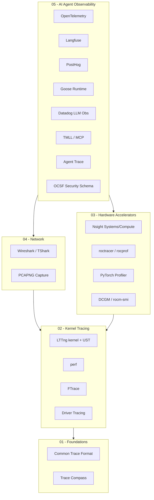

## Core Design Principles

These principles recur across every layer of the stack. Violating any of them leads to systemic problems.

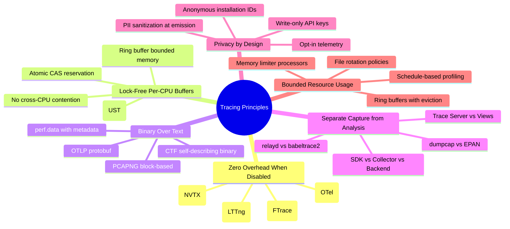

### 1. Zero Overhead When Disabled

Every instrumentation point must cost nothing when not actively collected:

| Layer | Mechanism | Disabled Cost |
|-------|-----------|---------------|
| Kernel (FTrace) | 5-byte NOP patching via `text_poke_bp` | 0 ns |
| Kernel (LTTng) | Static key / jump patching | ~0 ns |
| Userspace (LTTng-UST) | Single branch prediction | 1–2 ns |
| GPU (NVTX/ROCTX) | Check collector flag | <0.01% |
| GPU (DCGM) | Polling daemon at 1 Hz | <0.1% |
| Agent (OTel SDK) | NoOp tracer/meter | ~0 ns |

**Rule**: Compile all instrumentation in. Control activation at runtime, never at build time.

### 2. Lock-Free Per-CPU / Per-Thread Buffers

All high-performance tracing uses per-CPU (kernel) or per-thread (userspace) ring buffers:

- Atomic CAS for slot reservation - no locks, no priority inversion
- Each CPU/thread writes independently - no cross-core contention
- Consumer reads asynchronously - never blocks producer
- Bounded memory with explicit discard counting

### 3. Binary Formats for Production

| Format | Use Case | Advantage |
|--------|----------|-----------|
| CTF | Kernel/userspace traces (LTTng) | 50–80 bytes/event, nanosecond precision, self-describing |
| perf.data | CPU profiling, hardware counters | Includes build-ids, topology metadata |
| PCAPNG | Network capture | Block-based with interface metadata |
| OTLP protobuf | Distributed tracing export | Efficient wire format, full type info |
| Chrome Trace JSON | PyTorch/GPU profiling | Human-readable but 40–100× larger than CTF |

**Rule**: Use binary for production capture and archival. Use text/JSON only for interchange with tools that require it.

### 4. Separate Capture from Analysis

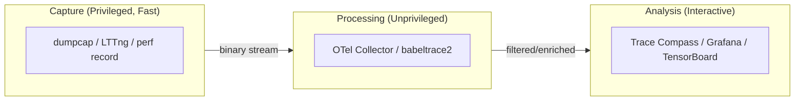

This separation enables:
- Independent scaling of each phase
- Security isolation (capture needs privileges; analysis doesn't)
- Format conversion without re-capture
- Multiple analysis backends from single capture


---

## Tool Selection

### Decision Tree

```mermaid
flowchart TD
    START{What do you need?} -->|CPU profiling / flame graphs| PERF[perf record + FlameGraph]
    START -->|Always-on production tracing| LTTNG[LTTng kernel + UST]
    START -->|Quick kernel debug, no setup| FTRACE[FTrace via tracefs]
    START -->|Worst-case latency| FTLAT[FTrace irqsoff/preemptoff]
    START -->|Hardware counters| PERFSTAT[perf stat]
    START -->|Exact code coverage / replay| INTELPT[Intel PT / ARM ETM]
    START -->|Memory hierarchy profiling| AMDIBS[AMD IBS]
    START -->|Always-on branch profiling| AMDLBR[AMD LBR / BRS]
    START -->|GPU utilization monitoring| DCGM[DCGM / rocm-smi]
    START -->|GPU kernel optimization| NCU[Nsight Compute / rocprof]
    START -->|Framework-level AI profiling| PYTORCH[PyTorch Profiler]
    START -->|Network protocol debugging| WIRE[Wireshark / TShark]
    START -->|LLM call debugging| LANGFUSE[Langfuse / Datadog LLM Obs]
    START -->|Agent adoption tracking| POSTHOG[PostHog]
    START -->|Vendor-neutral telemetry| OTEL[OpenTelemetry]
    START -->|Cross-layer correlation| TC[Trace Compass]
    START -->|AI-assisted trace analysis| TMLL[TMLL via MCP]
    START -->|VM pre-emption / stolen time| KVM[perf kvm stat + sched tracepoints]
    START -->|Container throttling / scheduling| CGROUP[cpu.stat + bpftrace cgroup filter]
    START -->|Agent telemetry pub/sub| MQTT[MQTT 5.0 broker]

    PERF -->|Need call stacks| DWARF["--call-graph dwarf"]
    PERF -->|Low overhead| FP["--call-graph fp"]
    INTELPT -->|x86_64| PT_X86["perf record -e intel_pt//"]
    INTELPT -->|AArch64| PT_ARM["perf record -e cs_etm//"]
    LTTNG -->|Post-mortem| SNAP[Snapshot mode]
    LTTNG -->|Continuous| RELAY[lttng-relayd]
```

### When to Use What

| Need | Primary Tool | Overhead | Notes |
|------|-------------|----------|-------|
| Where are CPU cycles spent? | `perf record` + flame graph | <1% at 99 Hz | Statistical sampling |
| Why is latency high? | FTrace latency tracers | Varies | Worst-case detection |
| What's the scheduler doing? | LTTng `sched_*` events | 1-3% | Deterministic capture |
| Always-on production events | LTTng kernel + UST | <5% | CTF output, loss counting |
| Hardware counter health | `perf stat` | ~0% | Counting mode, no sampling |
| Exact code coverage | Intel PT / ARM ETM | 2-5% | Every branch recorded |
| Deterministic bug replay | Intel PT / ARM ETM | 2-5% | Full control flow reconstruction |
| Memory hierarchy profiling | AMD IBS | <1% | Cache/TLB/NUMA per-sample |
| Always-on branch profiling | AMD LBR/BRS | <1% | 16-deep, never overflows |
| GPU fleet monitoring | DCGM (NVIDIA) / rocm-smi | <0.1% | 1 Hz polling |
| GPU kernel deep-dive | Nsight Compute / Omniperf | 10-100x | **Never in production** |
| PyTorch layer analysis | PyTorch Profiler | 3-8% | Use `schedule()` to bound |
| Agent-to-LLM-provider wire | TShark + SSLKEYLOGFILE | Capture-time only | Ring buffer mode |
| LLM trace hierarchy | Langfuse / Datadog | <1% (async) | Fire-and-forget batched |
| Cross-service distributed trace | OpenTelemetry | 1-3% | W3C Trace Context |
| Multi-source correlation | Trace Compass | Analysis-time only | Reads CTF, perf, JSON, pcap |
| VM pre-emption analysis | `perf kvm stat` + `sched_switch` | <1% host | Correlate stolen time with guest traces |
| Container throttling detection | `cpu.stat` + bpftrace | <1% | cgroup-filtered scheduling events |
| Agent telemetry fan-out | MQTT 5.0 (QoS 0) | 2-byte wire overhead | Persistent connections, broker-mediated |
| Agent presence / command dispatch | MQTT 5.0 (QoS 1) | Minimal | Will messages + retained status |

---

## Layer 02: Kernel Tracing Best Practices

### FTrace

**Do:**
- Always set `set_ftrace_filter` before enabling function tracing
- Use instances (`/sys/kernel/tracing/instances/<name>/`) for concurrent sessions
- Use in-kernel histograms (`hist:keys=<field>`) for zero-export aggregation
- Use `function_graph` tracer with `set_graph_function` for targeted call trees
- Use as first-responder tool - works in degraded states, no daemon dependency

**Don't:**
- Enable unfiltered function tracing in production (massive overhead)
- Leave tracing enabled after debugging (`echo nop > current_tracer`)
- Use text output for automated pipelines - it truncates and is ambiguous
- Confuse `trace` (snapshot, repeatable) with `trace_pipe` (consuming, one-time)

### perf

**Do:**
- Use 99 Hz sampling in production (prime frequency avoids timer aliasing)
- Use `perf stat` counting mode for precise hardware counter measurements
- Use event groups for related counters (ensures atomic scheduling)
- Prefer `CAP_PERFMON` over root for dedicated profiling users (kernel 5.8+)
- Request `precise_ip=3` (zero-skid) when available

**Don't:**
- Assume sampled values are exact (they're statistical estimates)
- Ignore `(XX.XX%)` annotations - they indicate PMU multiplexing/extrapolation
- Run Intel PT without size limits (60–600 MB/sec)
- Forget debug symbols - you'll get addresses instead of function names

### LTTng (Kernel + UST)

**Do:**
- Use `discard` mode in production (counts lost events explicitly)
- Use `overwrite` mode for flight-recorder / snapshot patterns
- Size buffers for workload: 4×1 MB minimum for production kernel tracing
- Always add context: `pid`, `tid`, `procname`, `perf:cpu:cycles`
- Use `per-uid` buffer mode for crash resilience (UST)
- Tunnel `lttng-relayd` over SSH/VPN - no built-in encryption

**Don't:**
- Use default 16 KB UST buffers in production (will discard under any load)
- Rely on session daemon without supervision (systemd auto-restart)
- Ignore disk space during long recordings (use triggers for rotation)
- Assume distributed trace propagation exists (it doesn't - manual correlation only)

### Driver Tracing Escalation Path

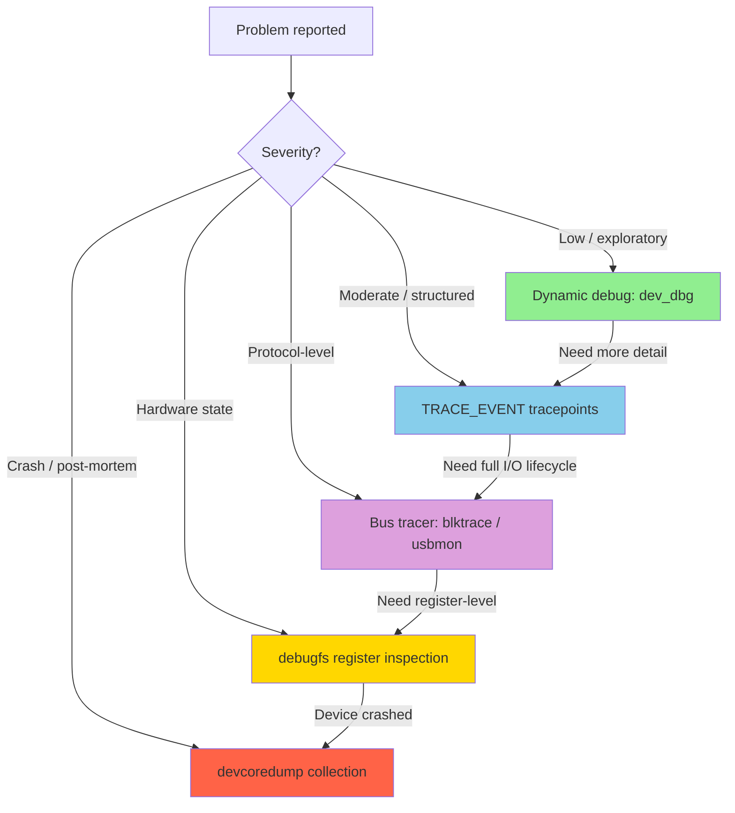


### Virtualization Tracing

Hypervisors insert a scheduling layer that fundamentally distorts guest-side timestamps. vCPU pre-emption creates invisible time gaps in guest traces.

**Do:**
- Pin vCPUs to physical cores (`virsh vcpupin`) for timing-sensitive tracing
- Use `perf kvm stat` for zero-setup exit-reason analysis
- Record `kvm:kvm_exit` + `sched:sched_switch` together to correlate pre-emption with exit events
- Check `%steal` in guest (`mpstat -P ALL 1`) before trusting guest-side latency numbers
- Use `kvmclock` (default) for wall-clock-aware guest timestamps
- Use SCHED_FIFO (`chrt -f -p 99`) for vCPU threads when trace accuracy matters
- Monitor `kvm_halt_poll_ns` to understand wakeup latency trade-offs

**Don't:**
- Trust guest-side latency measurements without verifying `%steal == 0`
- Assume guest hardware counters reflect true CPU behavior (PMU stops during pre-emption)
- Run timing-sensitive traces in nested virtualization (double-steal has no correction)
- Forget that `cycles != wall_time * frequency` inside VMs
- Ignore VFIO passthrough blind spots (host loses device visibility once guest owns IOMMU mapping)
- Compare traces from VMs without checking clock source consistency

**Key insight**: Host-side tracing shows ground truth. Guest traces are systematically distorted by pre-emption. Always correlate guest measurements with host scheduler tracepoints.

| Scenario | What to Trace | Where |
|----------|--------------|-------|
| Latency spike investigation | `kvm_exit` + `sched_switch` (QEMU PIDs) | Host |
| Exit reason profiling | `perf kvm stat live` | Host |
| Stolen time quantification | `mpstat %steal` + host `sched_switch` | Both |
| VFIO device performance | Guest-side CUPTI/rocprof (native accuracy) | Guest |
| Halt/wakeup latency | `kvm_halt_poll_ns` + `kvm_vcpu_wakeup` | Host |

### Container Orchestration Tracing

CFS throttling and cgroup bandwidth limits create timing gaps invisible to application traces. Scheduler tracepoints expose the truth.

**Do:**
- Monitor `cpu.stat` (`nr_throttled`, `throttled_usec`) for every latency-sensitive container
- Use `sched_stat_wait` tracepoints to detect noisy-neighbor runqueue contention
- Filter traces by cgroup ID (perf `--cgroup`, bpftrace `cgroup == cgroupid(...)`)
- Set `requests == limits` (Guaranteed QoS) for containers that need timing accuracy
- Use CPU Manager static policy (`--cpu-manager-policy=static`) for exclusive CPU pinning
- Correlate wall-clock span durations with `sched_stat_runtime` to compute scheduling overhead
- Use Inspektor Gadget for Kubernetes-native BPF tracing without host access

**Don't:**
- Trust application-level span durations without checking for CFS throttling (100ms gaps per period)
- Assume stable latency in Burstable QoS class (variable with neighbor activity)
- Ignore memory pressure (`memory.pressure`, `memory.events`) as a source of syscall latency spikes
- Mount tracefs into containers without understanding the security implications
- Forget that pod pre-emption/eviction truncates all in-flight traces if not flushed externally
- Compare latency across pods without accounting for different cgroup bandwidth limits

**Key insight**: Application-level spans (OpenTelemetry, Langfuse) report wall-clock time that INCLUDES all scheduling distortion. A 100ms span might be 5ms of computation + 95ms of CFS throttle. Only kernel tracepoints can decompose wall-clock into CPU-time vs throttle vs runqueue-wait.

| Problem | What to Check | How |
|---------|--------------|-----|
| Unexplained latency spikes | CFS throttling | `cat cpu.stat \| grep nr_throttled` |
| Variable latency under load | Noisy neighbor | `bpftrace sched_stat_wait` filtered by cgroup |
| Pod startup slow | Scheduling + image pull | kubelet OTel spans + containerd events |
| Memory-related hangs | Direct reclaim | `memory.pressure` + `vmscan:*` tracepoints |
| Network latency between pods | Namespace overhead | `net:net_dev_xmit` with netns context |

```bash
# Quick container throttling check
for cg in /sys/fs/cgroup/kubepods.slice/*/*/cpu.stat; do
    throttled=$(grep nr_throttled "$cg" | awk '{print $2}')
    if [ "$throttled" -gt 0 ]; then
        echo "$cg: throttled $throttled times"
    fi
done
```

---

## Layer 03: Hardware Accelerator Best Practices

### Layered Profiling Strategy (GPU + CPU)

```mermaid
flowchart LR
    subgraph Always["Always-On (Production)"]
        DCGM_P["DCGM 1 Hz\n< 0.1% overhead"]
        ROCTX_P["NVTX/ROCTX annotations\n< 0.01% overhead"]
        AMD_IBS["AMD IBS/LBR\n< 1% overhead"]
    end

    subgraph Bounded["Bounded Sessions (Staging)"]
        NSYS["Nsight Systems\n1-3% overhead"]
        PYTORCH_P["PyTorch Profiler\n3-8% overhead"]
        ROCT["roctracer\n2-5% overhead"]
        PT_TRACE["Intel PT / ARM ETM\n2-5% overhead"]
    end

    subgraph Targeted["Targeted Deep-Dive (Dev Only)"]
        NCU_P["Nsight Compute\n10-100x slower"]
        OMNIPERF["Omniperf\nmulti-pass counters"]
    end

    Always -->|anomaly detected| Bounded
    Bounded -->|kernel identified| Targeted
```

### Key GPU Metrics for AI Workloads

| Metric | NVIDIA | AMD | What It Tells You |
|--------|--------|-----|-------------------|
| Tensor core utilization | DCGM field 1009 (TENSOR_ACTIVE) | SQ_INSTS_VALU_MFMA_* | Is AI-specific hardware being used? |
| SM/CU occupancy | SM_ACTIVE | GPU_UTIL + SQ_WAVES | Are compute units busy? |
| Memory bandwidth | DRAM_ACTIVE | FETCH_SIZE + WRITE_SIZE | Memory-bound vs compute-bound? |
| PCIe throughput | PCIE_TX/RX bytes | PCIe counters | Host↔device bottleneck? |

### PyTorch Profiler Configuration

```python
# Recommended production-safe pattern
with torch.profiler.profile(
    activities=[ProfilerActivity.CPU, ProfilerActivity.CUDA],
    schedule=torch.profiler.schedule(
        wait=1,      # Skip cold start
        warmup=1,    # Stabilize overhead
        active=3,    # Collect (bounded!)
        repeat=2     # Statistical confidence
    ),
    on_trace_ready=torch.profiler.tensorboard_trace_handler("./log"),
    record_shapes=True,     # Which dimensions drive cost
    profile_memory=True,    # Allocation patterns
    with_flops=True,        # Theoretical FLOPS
    with_modules=True,      # Layer attribution
    # with_stack=True       # ← DEV ONLY: 5–15% overhead
) as prof:
    for step in range(20):
        train_step(model, batch)
        prof.step()
```

### NVTX/ROCTX Annotation Convention

Always annotate training phases - near-zero cost, activates only when profiler collects:

```python
# Standard annotation structure
with nvtx.annotate("epoch", color="green"):
    with nvtx.annotate("training_step", color="blue"):
        with nvtx.annotate("forward", color="yellow"):
            output = model(input)
        with nvtx.annotate("backward", color="red"):
            loss.backward()
        with nvtx.annotate("optimizer", color="purple"):
            optimizer.step()
        with nvtx.annotate("communication", color="orange"):
            dist.all_reduce(grads)
```

### GPU Pitfalls

| Pitfall | Why It's Dangerous | Mitigation |
|---------|-------------------|------------|
| Nsight Compute in production | 10–100× kernel replay slowdown | Dev/staging only; use DCGM for production |
| CUPTI buffer overflow | Silent data loss; no error signal | Pre-size buffers; monitor OVERHEAD activity |
| Counter multiplexing | Values from different executions compared as simultaneous | Limit counters per pass; document which pass each came from |
| `with_stack=True` | 5–15% Python stack unwinding overhead | Development only |
| Unbounded PyTorch traces | 0.5–10 MB/step → multi-GB files | Always use `schedule()` |
| Trace exposes model architecture | Kernel names contain matrix dimensions | Treat trace files as sensitive IP |
| FLOPS estimates are theoretical | `with_flops` calculates from shapes, not actual efficiency | Don't equate high FLOPS with efficient execution |

### Processor Tracing (Intel PT / ARM ETM / AMD IBS)

Hardware processor tracing records instruction-level control flow directly from the CPU pipeline. Three vendors, two fundamentally different approaches:

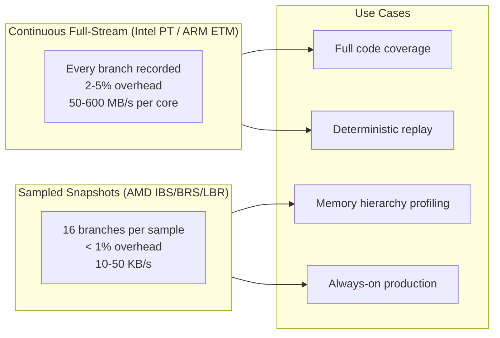

**When to use which:**

| Scenario | Best Choice | Why |
|----------|-------------|-----|
| Reproduce rare bug exactly | Intel PT / ARM ETM | Full replay requires every branch |
| Code coverage of inference engine | Intel PT / ARM ETM | Completeness required |
| Memory latency optimization | AMD IBS | Records cache/TLB/NUMA per-access |
| Always-on branch profiling | AMD LBR/BRS | <1% overhead, never overflows |
| Branch misprediction analysis | AMD IBS | Mispredict flag per sample |
| ARM server (Graviton/Ampere) | ARM ETM | Only full-trace option for AArch64 |
| Minimize storage | AMD IBS/BRS | 100-1000x less data than PT/ETM |

**Do:**
- Keep NVTX/ROCTX annotations in code permanently (free without collector)
- Use `perf record -e intel_pt//u --aux-size=16M` for bounded user-mode traces
- Use AMD IBS (`perf record -e ibs_op/cnt=100000/`) for always-on memory profiling
- Preserve build artifacts (PT/ETM decode requires exact binary match)
- Use snapshot mode for flight-recorder patterns (capture on anomaly only)

**Don't:**
- Run Intel PT/ARM ETM unbounded in production (50-600 MB/s per core fills disks fast)
- Forget `--aux-size` sizing (default too small -> overflow -> silent data loss)
- Share trace files without redaction (kernel names reveal matrix dimensions/model architecture)
- Assume AMD LBR gives complete coverage (it's 16-deep statistical samples)
- Mix counter passes and compare as if simultaneous (AMD rocprof multi-pass issue)

### Processor Tracing Pitfalls

| Pitfall | Why It's Dangerous | Mitigation |
|---------|-------------------|------------|
| Intel PT unbounded capture | 50-600 MB/s fills disk in minutes | Always set `--aux-size` and duration limits |
| Missing binary for decode | Entire PT/ETM trace is useless without exact build | perf records build-ids; preserve artifacts |
| Nsight Compute + Intel PT | Both compete for PMU resources | Never combine; use sequentially |
| AMD IBS for coverage | Statistical - cannot prove all paths taken | Use Intel PT/ARM ETM for coverage guarantees |
| Trace in production without ring buffer | Single capture fills, then stops or drops | Use snapshot/flight-recorder mode |
| Ignoring OVF packets | Silent gaps in trace - analysis misses events | Monitor overflow; increase buffer if > 0 |
| Comparing cross-core timestamps | Per-core traces have independent timelines | Post-process with timestamp normalization |


---

## Layer 04: Network Capture Best Practices

### Privilege Separation Model

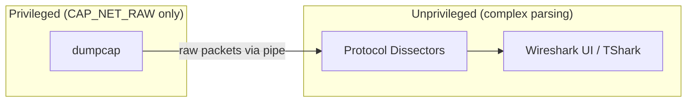

**Rule**: Never run Wireshark/TShark as root. Use `dumpcap` with minimal capabilities.

### Bounded Capture

```bash
# Ring buffer prevents disk exhaustion
dumpcap -i eth0 -b filesize:102400 -b files:10 -w /captures/agent.pcapng

# Kernel-level capture filter (reduces load before userspace)
tshark -i eth0 -f "tcp port 443 or tcp port 4317 or tcp port 4318"

# TLS decryption for agent traffic analysis
SSLKEYLOGFILE=/tmp/keys.log tshark -i eth0 -o tls.keylog_file:/tmp/keys.log
```

### Network Pitfalls

- PCAPNG files contain unredacted PII, passwords, tokens - treat as sensitive
- TShark dissection is single-threaded - won't scale for high-volume continuous capture
- Heuristic dissectors can misidentify protocols - validate with display filters
- Capture files grow unbounded without ring buffer mode

### MQTT for Agent Telemetry

MQTT provides lightweight pub/sub messaging with minimal wire overhead (2-byte fixed header for QoS 0). Well-suited for high-fan-out agent telemetry, presence detection, and command dispatch.

**Do:**
- Use QoS 0 for high-frequency metrics (tokens/s, GPU utilization) where occasional loss is acceptable
- Use QoS 1 for important events (agent status changes, error reports) that need at-least-once delivery
- Reserve QoS 2 for critical control messages only (expensive 4-packet handshake)
- Design topic hierarchies for both specific addressing and wildcard monitoring: `agents/{id}/telemetry` + subscribe `agents/+/telemetry/#`
- Use retained messages for agent status topics (new subscribers get last known state immediately)
- Use shared subscriptions (`$share/group/topic`) to load-balance telemetry processing across consumers
- Set `message_expiry_interval` on telemetry publishes to prevent stale data delivery to reconnecting subscribers
- Use Will messages for ungraceful disconnect detection (automatic presence management)
- Use MQTT 5.0 user properties to carry trace correlation IDs without modifying payloads
- Enable TLS 1.2+ for all production broker connections; use mTLS for device/agent identity
- Use topic aliases (MQTT 5.0) to reduce per-message wire overhead on frequently-published topics

**Don't:**
- Use QoS 2 at scale for telemetry (4-step handshake per message kills throughput)
- Create unbounded topic namespaces (millions of unique topics degrades broker routing)
- Rely on the broker for message replay or event sourcing (broker is a router, not a store)
- Trust ordering across multiple publishers to the same topic (only per-client ordering guaranteed)
- Store secrets or model weights in MQTT payloads without application-layer encryption (broker sees plaintext)
- Ignore persistent session queue depth for offline agents (unbounded queues cause broker OOM)
- Skip keep-alive configuration (dead connections consume broker resources indefinitely)

**Topic namespace pattern for AI agent infrastructure:**

```
agents/
  {agent-id}/
    telemetry          # QoS 0, high frequency, not retained
    status             # QoS 1, retained (online/offline/degraded)
    commands           # QoS 1, inbound control messages
    responses          # QoS 1, command acknowledgments
  orchestrator/
    assignments        # Task routing decisions
    scaling            # Autoscaler events
```

**MQTT vs alternatives for agent telemetry:**

| Need | MQTT | HTTP/REST | gRPC |
|------|------|-----------|------|
| High-frequency metrics (100+ agents) | QoS 0, 2-byte overhead, persistent conn | Per-request overhead, connection churn | Streaming works but heavier framing |
| Presence detection | Will messages + retained status (built-in) | Requires heartbeat polling | Requires keep-alive implementation |
| Fan-out to N consumers | Broker handles routing, zero publisher knowledge | N requests or webhook infrastructure | Requires pub/sub layer on top |
| Edge/constrained devices | Designed for this (MCU to cloud on same protocol) | Heavy headers, TLS handshake per request | Protobuf helps but HTTP/2 is heavy |
| Command dispatch | Subscribe to `agents/{id}/commands` | Poll or WebSocket | Bidirectional streaming works |

**Broker observability:**
- Subscribe to `$SYS/broker/#` for self-monitoring via MQTT itself
- Export Prometheus metrics from broker (Mosquitto exporter, EMQX native, HiveMQ plugin)
- Monitor `$SYS/broker/clients/connected` for fleet size tracking
- Set alerts on message delivery latency and subscription count growth

---

## Layer 05: AI Agent Observability Best Practices

### Triple Telemetry Pipeline

The recommended architecture for AI agent telemetry emits to three independent sinks:

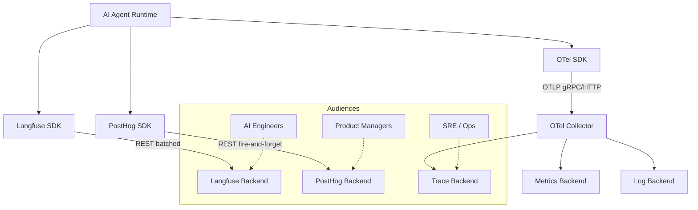

| Sink | Purpose | Audience | Failure Mode |
|------|---------|----------|--------------|
| OpenTelemetry | Distributed traces, metrics, logs | SRE / Platform | Backpressure via collector |
| Langfuse | LLM call hierarchy, prompts, latency | AI Engineers | Fire-and-forget (data loss ok) |
| PostHog | Adoption funnels, feature usage | Product Managers | Silent drop (privacy-safe) |

**Critical rule**: Telemetry failure must NEVER block agent operation.

### Hierarchical Span Model

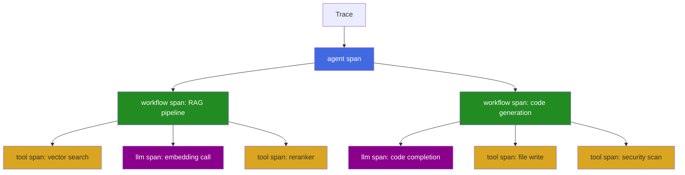

Standardize on: **agent → workflow → tool / llm / retrieval** for cross-platform compatibility (works with both Datadog and Langfuse span types).

### OpenTelemetry Collector Configuration

```yaml
receivers:
  otlp:
    protocols:
      grpc: { endpoint: "0.0.0.0:4317" }
      http: { endpoint: "0.0.0.0:4318" }

processors:
  memory_limiter:
    check_interval: 1s
    limit_mib: 512
    spike_limit_mib: 128
  redaction:
    blocked_values: ["sk-.*", "pk-.*", "Bearer .*"]
  batch:
    timeout: 5s
    send_batch_size: 512

exporters:
  otlp/primary: { endpoint: "backend:4317" }

service:
  pipelines:
    traces:
      receivers: [otlp]
      processors: [memory_limiter, redaction, batch]
      exporters: [otlp/primary]
```

### Privacy-Preserving Telemetry

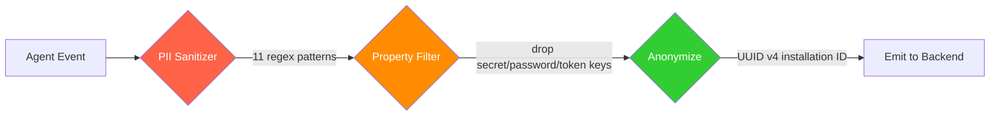

**Rules:**
- Strip PII at the emission boundary, not the storage boundary
- Use anonymous installation IDs (UUID v4), never human-identifiable info
- Drop property keys containing: `secret`, `password`, `credential`, `key`, `token`
- Explicit opt-in required - never silent collection
- Never transmit conversation content, file content, or tool output in analytics

### Agent Security Scanning

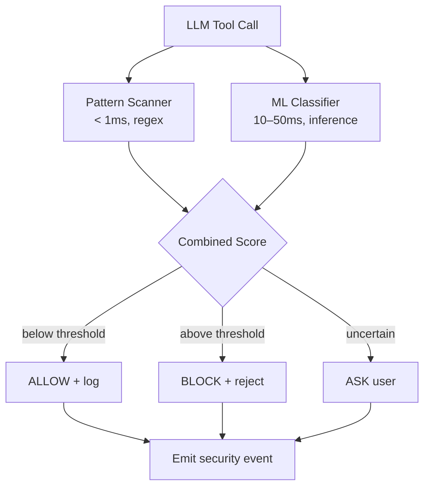

**Rules:**
- Enable `SECURITY_PROMPT_ENABLED=true` in all non-development environments
- Dual-mode scanning (fast patterns + slower ML) balances latency with accuracy
- MCP extensions execute with full user privileges by default - consider container isolation for untrusted extensions
- Implement content redaction processor before any telemetry export


---

## Cross-Layer Integration Patterns

### Pattern 1: Full-Stack AI Workload Correlation

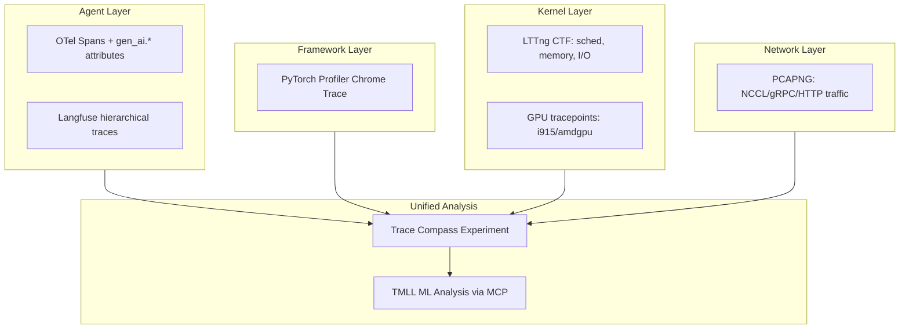

**Correlation keys:**
- Timestamps (convex hull sync for multi-node)
- Process/thread IDs across layers
- W3C Trace Context headers (visible in decrypted TLS)
- Session IDs as shared attributes

### Pattern 2: Production Monitoring Pipeline

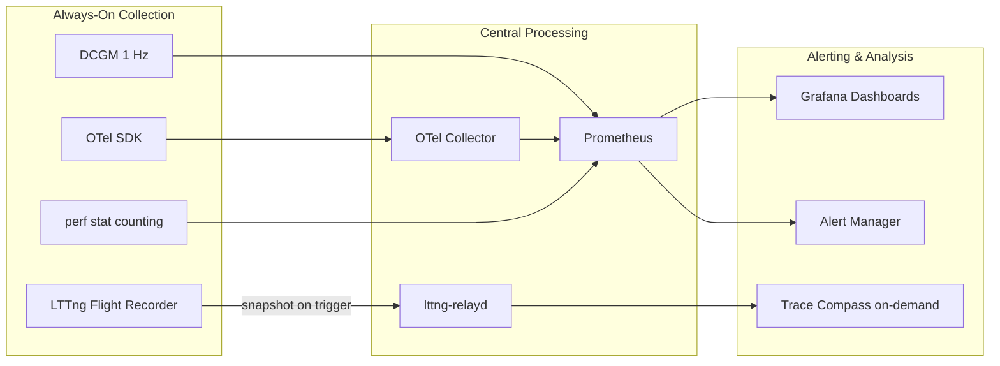

**Production alert thresholds:**
- GPU TENSOR_ACTIVE < 50% → tensor core underutilization
- GPU DRAM_ACTIVE > 90% → memory bottleneck
- LTTng events_discarded > 0 → buffer undersized
- OTel export failures > threshold → backend degraded

### Pattern 3: AI Agent → Trace Analysis Loop

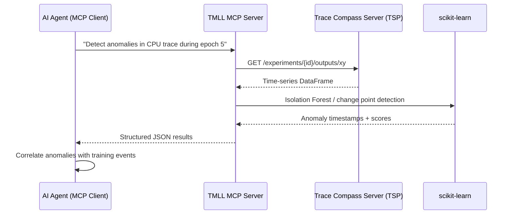

### Pattern 4: Distributed Training Observability

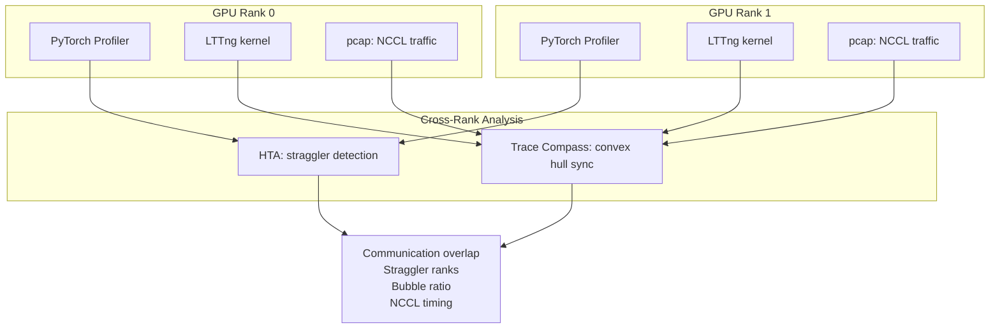

### Pattern 5: Security Event Correlation via OCSF

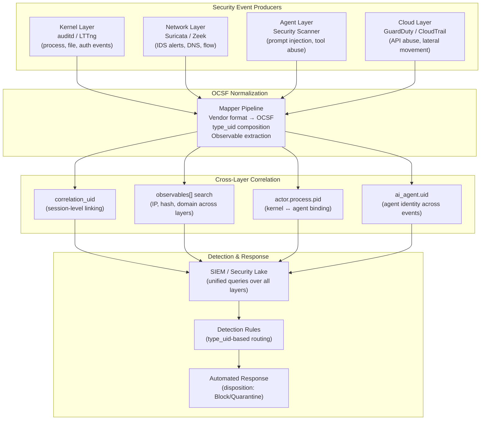

**How OCSF correlates the AAIF stack:**

OCSF provides a common schema so that security events from every layer can be queried together without per-vendor translation at analysis time. The correlation keys are:

| Key | What It Links | Example |
|-----|---------------|---------|
| `correlation_uid` | All events from same agent session | Agent invocation → tool calls → LLM auth → findings |
| `observables[].value` | Any event mentioning same indicator | IP in network alert = IP in cloud finding = IP in agent connection |
| `actor.process.pid` | Agent process across kernel and app layers | auditd syscall event → same PID in OTel span → same PID in OCSF finding |
| `ai_agent.uid` | All security events for one agent identity | Across runs, restarts, multiple invocations |
| `type_uid` | Precise event type filtering | 200401 = Detection Finding/Create — same meaning regardless of source |
| `device.hostname` | All events from same host | Kernel + network + agent events joined by machine |

**Do:**
- Emit `correlation_uid` matching the OTel `trace_id` for the agent session — this links OCSF security events to performance traces
- Populate `observables[]` for every finding — this enables indicator-centric search across all event sources
- Use `ai_agent.uid` consistently across Detection Findings, Authentication events, and API Activity events
- Apply the `security_control` profile to any event where a security decision was made (allow/block/quarantine)
- Set `confidence_score` calibrated to actual precision at that threshold

**Don't:**
- Invent custom event classes when core classes exist — use `type_uid` 99 (Other) activity with sibling string instead
- Omit `metadata.version` — consumers need this to parse events correctly across schema updates
- Mix OCSF versions in the same pipeline without version-aware routing
- Store raw prompts in OCSF events without content redaction — use enrichment pipeline to sanitize first
- Assume `correlation_uid` propagates automatically — explicitly inject it at the agent runtime level

**Integration with existing patterns:**
- Pattern 1 (Full-Stack Correlation): OCSF adds the security dimension — same session has both performance traces (OTel) and security findings (OCSF) linked via shared correlation_uid
- Pattern 2 (Production Monitoring): OCSF Detection Findings feed the alerting pipeline alongside metric thresholds
- Pattern 3 (AI Agent → Trace Analysis): TMLL anomaly detection results can be emitted as OCSF Detection Findings for downstream SIEM consumption

---

## Cross-Layer Synergies

The real power of this stack emerges when layers share context. A kernel trace that records every TID-to-CPU mapping becomes a shared index that other layers can reference without duplicating context per event.

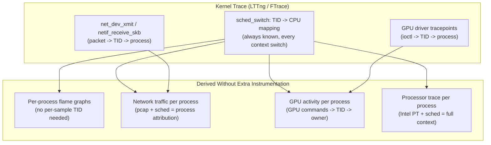

### Synergy 1: Kernel sched_switch eliminates per-event context

When LTTng/FTrace records `sched_switch`, every TID-to-CPU assignment is known at every point in time. Other trace sources on the same timeline can omit per-event process context:

- **Flame graphs from perf sampling**: Each sample only needs a CPU number and timestamp. Trace Compass reconstructs which process was running on that CPU at that instant from the kernel state system. No `comm` or `pid` field needed per sample.
- **Intel PT / ARM ETM**: The processor trace stream identifies which core produced it. The kernel trace provides the process context. Result: full per-process instruction traces without PT needing to record process switches itself.
- **Hardware counters (perf stat per-CPU)**: Raw counter deltas per CPU become per-process counters when cross-referenced with sched_switch intervals.

**Overhead saving**: Eliminating a 16-byte context field from millions of events saves significant trace bandwidth and storage.

### Synergy 2: Network capture attributed to processes via kernel trace

Raw pcap has no process information - packets are just bytes on a wire. But the kernel knows which socket belongs to which process:

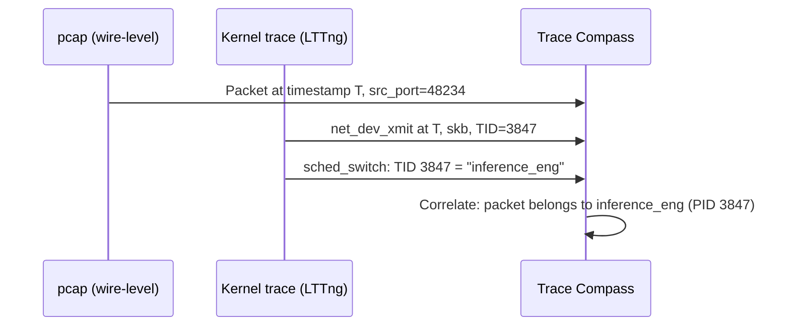

**Result**: Every packet in the capture is annotated with the owning process, without any application-level instrumentation. You get per-process network bandwidth, latency, and protocol breakdowns for free.

**AI workload example**: In distributed training, NCCL traffic (AllReduce, AllGather) can be attributed to specific training ranks and correlated with GPU kernel timing - revealing whether communication or computation is the bottleneck for each rank.

### Synergy 3: GPU counters sampled with process context from kernel

GPU hardware counters (DCGM, rocm-smi) report per-GPU aggregate values. They don't know which process caused the utilization. But kernel driver tracepoints record which TID submitted each GPU command:

- `i915_request_submit` / `amdgpu_cs_ioctl` - ties a GPU command to a TID
- `sched_switch` - ties TID to a named process
- `dma_fence_signaled` - marks GPU command completion

**Result**: Per-process GPU utilization, memory bandwidth, and tensor core usage - derived from combining kernel trace with GPU counters, without per-process GPU profiling (which would require CUPTI/rocprof per-process and multiply overhead).

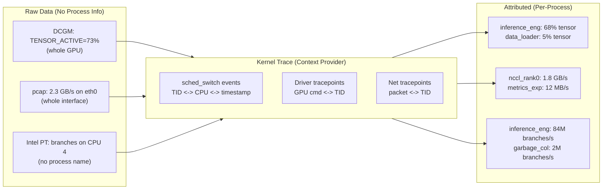

### Synergy 4: PyTorch Profiler + kernel trace = end-to-end latency decomposition

PyTorch Profiler records framework-level ops (`aten::mm`, `aten::linear`). The kernel trace records what happened underneath. Together in a Trace Compass experiment:

| Layer | Records | Alone | Combined |
|-------|---------|-------|----------|
| PyTorch Profiler | `aten::mm` took 4.2ms | Just the total time | Breakdown: 0.3ms CPU dispatch + 3.8ms GPU + 0.1ms sync |
| Kernel sched | Process was preempted 2x during dispatch | Just scheduling events | Identifies 0.15ms of that 0.3ms was involuntary preemption |
| GPU driver trace | GPU command queued -> executed -> signaled | Just command lifecycle | Links the 3.8ms to specific GPU kernel and queue depth |
| Network trace | NCCL AllReduce started during backward pass | Just packet timing | Shows 12ms gradient sync overlapping with next forward pass |

**No single layer can produce this breakdown alone.** The kernel trace is the glue - it provides the TID/timing context that links all other layers.

### Synergy 5: AMD IBS + Intel PT = complete picture (cross-reference)

On Intel systems, combining PT with perf PMU sampling gives both:
- **What path was taken** (Intel PT - every branch)
- **What the memory system did** (perf mem / cache-miss sampling)

On AMD systems, IBS natively provides both branch direction AND memory hierarchy state per sample. But combining AMD IBS with Intel PT (on Intel) or ARM ETM (on ARM) gives:
- PT/ETM: identifies the exact hot loop (100% coverage)
- IBS/perf-mem: explains WHY it's hot (L3 miss rate, NUMA remote access)

### Summary: The Kernel Trace as Shared Index

| Synergy | What kernel provides | What it enables | Overhead saved |
|---------|---------------------|-----------------|----------------|
| Flame graph attribution | TID-to-CPU mapping | Per-sample context omitted | ~16 bytes/sample |
| Network per-process | Packet-to-TID binding | pcap annotated with process names | No app instrumentation needed |
| GPU per-process | GPU cmd-to-TID binding | Per-process GPU utilization | Avoids per-process CUPTI overhead |
| PT/ETM per-process | CPU-to-TID mapping | Full instruction trace per process | PT doesn't need context packets |
| End-to-end latency | Scheduling + preemption state | Framework op decomposed into HW phases | Single capture, multiple analyses |

**Principle**: Invest in one high-quality kernel trace (LTTng CTF, always-on). It becomes the shared context index that makes every other trace source more valuable without increasing their individual overhead.

---

## Overhead Budget Reference

Plan your instrumentation within these overhead envelopes:

| Category | Overhead | Production Safe? | Notes |
|----------|----------|-----------------|-------|
| NVTX/ROCTX (no collector) | <0.01% | ✅ Always | Annotate everything |
| DCGM 1 Hz polling | <0.1% | ✅ Always | Primary GPU monitoring |
| `perf stat` counting | ~0% | ✅ Always | Hardware counters |
| AMD IBS/LBR (low sample rate) | <1% | ✅ Always | Memory/branch profiling |
| LTTng flight recorder | 1-3% | ✅ Always | Snapshot on anomaly |
| OTel SDK (batched async) | <1% | ✅ Always | Agent telemetry |
| `perf record` @ 99 Hz | <1% | ✅ Bounded | CPU profiling |
| Nsight Systems | 1-3% | ⚠️ Time-bounded | System-wide timeline |
| Intel PT / ARM ETM (user-only) | 2-5% | ⚠️ Time-bounded | Full branch trace |
| LTTng (heavy event set) | 3-5% | ⚠️ Bounded | All sched + syscall |
| PyTorch Profiler (basic) | 3-8% | ⚠️ schedule() only | Framework profiling |
| roctracer API trace | 2-5% | ⚠️ Bounded | AMD GPU API timing |
| Intel PT / ARM ETM (kernel+user) | 5-15% | ⚠️ Short captures only | High kernel branch rate |
| PyTorch Profiler (full + stack) | 5-15% | ❌ Dev only | Includes Python unwinding |
| Nsight Compute (per-kernel) | 10-100x | ❌ Never production | Kernel replay isolation |

**Total production budget**: Keep combined always-on instrumentation under 5% total overhead.

---

## Security Checklist

Security is the weakest dimension across the entire tracing stack. Apply these compensating controls:

```mermaid
flowchart TD
    subgraph Must["Must Have"]
        ENC_REST[Encrypt traces at rest\ndm-crypt / LUKS]
        ENC_TRANSIT[Encrypt in transit\nSSH tunnel / TLS]
        ACCESS[Access control\ntracing group / RBAC]
        REDACT[Redact sensitive fields\nbefore export]
        ROTATE[Rotate API keys\non schedule]
    end

    subgraph Should["Should Have"]
        AUDIT[Audit who captured\nwhat traces]
        SANDBOX[Sandbox MCP extensions\ncontainer/namespace]
        RETENTION[Retention policies\nauto-delete aged traces]
        PRIV_SEP[Privilege separation\ncapture vs analysis]
    end

    subgraph Nice["Nice to Have"]
        SIGNED[Signed traces\ntamper detection]
        IDENTITY[Operator identity\nbound to trace session]
        NAMESPACE[Container-native\ntrace isolation]
    end
```

### Universal Security Gaps (all layers)

| Gap | Impact | Workaround |
|-----|--------|-----------|
| No encryption at rest | Traces readable by anyone with file access | Filesystem-level encryption (LUKS) |
| No encryption in transit | Network sniffing of trace data | SSH tunnels for relayd, TLS for OTLP |
| No operator identity binding | Can't audit who captured what | External audit log + access controls |
| Trace files expose IP | GPU kernel names contain matrix dims; model architecture visible | Treat traces as sensitive; restrict access |
| No container-native isolation | tracefs/perf not namespaced | Host-level access control only |
| MCP extensions run with full privileges | Untrusted code has user-level access | Container/namespace isolation |
| Prompt content stored in cleartext | LLM I/O visible in trace backends | Content redaction processor before export |

---

## Common Anti-Patterns

| Anti-Pattern | What Goes Wrong | Correct Approach |
|-------------|-----------------|------------------|
| Tracing everything at all times | System slowdown, disk exhaustion, noise | Layered: always-on (low-overhead) + triggered deep capture |
| Fire-and-forget telemetry with no retry | Permanent data loss on transient failures | Exponential backoff + local WAL buffer |
| Unbounded batch buffers | Memory exhaustion when backend is slow | Max buffer size with oldest-event eviction |
| Head sampling for AI workloads | Errors are rare but critical - missed by head sampling | Tail sampling (hold until decision) or always-sample errors |
| Single telemetry sink | One backend failure = complete blindness | Triple pipeline (OTel + LLM-specific + analytics) |
| Text parsing for production trace analysis | Truncation, ambiguity, parsing overhead | Binary formats (CTF, perf.data, protobuf) |
| Profiling without `schedule()` bounds | Multi-GB trace files, overhead distorts results | Wait → warmup → active → repeat pattern |
| Trusting token counts from local tokenizer | Different from provider billing | Reconcile with provider-reported usage |
| Leaving debug tracing enabled post-session | Permanent performance degradation | Auto-disable timers; clean shutdown hooks |
| Running analysis tools as root | Unnecessary privilege; security risk | Privilege separation (capture privileged, analysis unprivileged) |

---

## Quick-Start Recipes

### Minimal Always-On Production Stack

```bash
# 1. GPU monitoring (NVIDIA)
dcgmi dmon -e 1004,1005,1009,1010,1011,1012 &

# 2. Kernel flight recorder
lttng create --snapshot prod-flight
lttng enable-event -k sched_switch,sched_wakeup,irq_handler_entry
lttng add-context -k -t pid -t tid -t procname
lttng start

# 3. Hardware counters
perf stat -a -e cycles,instructions,cache-misses -I 10000 &

# 4. Agent telemetry
export OTEL_EXPORTER_OTLP_ENDPOINT=http://collector:4318
export OTEL_EXPORTER_OTLP_PROTOCOL=http/protobuf
```

### Deep Investigation (Time-Bounded)

```bash
# GPU timeline (60 seconds max)
nsys profile --trace=cuda,nvtx,cudnn,cublas --duration=60 python train.py

# Kernel + userspace correlation
lttng create investigation
lttng enable-event -k sched_switch,sched_wakeup,block_rq_issue,net_dev_xmit
lttng enable-event -u 'my_app:*'
lttng start
# ... reproduce issue ...
lttng stop && lttng destroy

# Network capture (ring buffer)
dumpcap -i eth0 -b filesize:102400 -b files:5 -w /tmp/debug.pcapng &
```

### Cross-Layer Analysis

```bash
# Merge into Trace Compass experiment:
# 1. Import LTTng CTF directory
# 2. Import PyTorch Chrome Trace JSON
# 3. Import pcapng capture
# 4. Create experiment → Trace Compass correlates by timestamp
# 5. Use TMLL MCP for ML-assisted anomaly detection
```

---

## Summary: The Five AAIF Evaluation Dimensions

Every technology in this stack is assessed across these dimensions:

| Dimension | Kernel Layer | GPU Layer | Network | Agent Layer | Primary Gap |
|-----------|-------------|-----------|---------|-------------|-------------|
| **Observability** | Strong | Strong | Strong | Strong | No cross-vendor unified GPU format |
| **Security** | Partial | Weak | Moderate | Partial | No encryption; traces expose IP |
| **Identity** | Minimal | Weak | None | Partial | No operator/agent binding in lower layers |
| **Reliability** | Strong | Moderate | Strong | Moderate | Agent telemetry fire-and-forget losses |
| **Accuracy** | Strong | Moderate | Strong | Moderate | Token counts approximate; clock skew |

**The universal takeaway**: Observability is strong across all layers. Security and identity are systematically weak - compensating controls (encryption, access control, audit logging) must be layered on externally. Reliability degrades as you move up the stack from kernel (deterministic capture) to agent (best-effort async export).

---

*Generated from the AAIF Reference Architecture collection - 22 documents across 5 layers.*
